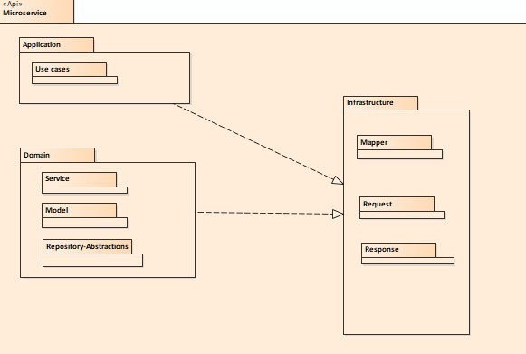
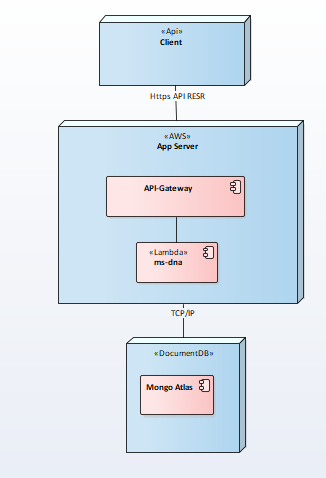

# ms-dna
Microservicio para la validacion de DNA mutante, requerido por Magneto para el proceso de seleccion de sus trabajadores y 
combatir a los X-man :) :O 

# Servicios Expuestos:
1) POST 

isMutant: Recibe un arreglo de string que representa el ADN a evnaluar 

Ejemplo de consumo:
URL: 
> https://s2h06thmnd.execute-api.us-east-1.amazonaws.com/test/mutant

request BODY:

>  {"dna":["ATGCGA","CAGTGC","TTATGT","AGAAGG","CCCCTA","TCACTG"]}

Posibles Responses:
- 200 OK si es un mutante
- 403 Forbidden si no es un mutante 
- 400 Bad Request si el payload no cumple con la reglas de negocio SOLO ATCG, matriz NxN con columnas y filas de igual tamanio
- 500 Errores del servidor

2) GET 
Stats: Calcula las estadisticas de los ADNs evaluados, indicando la cantidad de ADNs mutantes, la cantidad de ADNs no mutantes (Humanos) y la correlación entre ambos (Ratio)

Ejemplo de consumo:

URL:

>  https://s2h06thmnd.execute-api.us-east-1.amazonaws.com/test/stats

Posibles Responses:
- 200-OK Junto con el JSON de respuesta {"count_mutant_dna": 2,"count_human_dna": 1,"ratio": 2}
- 500 Errores del servidor


# Detalles de la solucion
- Se realiza en lenguaje Golang
- Uso de variables de ambiente para la configuración

- Conexión con base de datos MONGO, proveedor Mongo Atlas que nos ofrece clusterización para mayor disponibilidad.

- Se hospeda en AWS Lambda con el fin de soportar Auto-Escalamiento dado el reqierimiento de posibles picos de consumos, esto nos ayuda a ahorrar costos de mantenimiento de Infraestructura pero a la vez tiene un downside costos cuando la cantidad de requests empieza a superar el umbral de los 90millones de consumos al mes ..en este caso es mejor explorar opciones de CONTENERIZACIÓN y hacer uno de algún servicoi nube de KUBERNETES para la gestión del balanceo, enrrutamiento 

Para el diseño se hace uso de Domian Driven Design 
- Capa de  Aplicacion 
- capa de dominio 
- Capa de Infraestructura
La comunicación entre las capas se hace de manera abstracta, a fin de no depender de la implementación

Diseño:




Despliegue:




# Covertura de pruebas 
Se corren sobre el paquete de servicios de dominio, carpeta "ms-dna/pkg/dna/domain/service", se supone 
que las pruebas deberían concentrarsen en la capa de negocio.
En los demás paquetes se podrían aplicar otros tipos de  pruebas como por ejemplo las de integración

Ejecute el siguiente comando 
> $ go test -cover

Respuesta (Note que supera el 80%, que es la mínima permitida)
~.../ms-dna/pkg/dna/domain/service$ go test -cover
> PASS
>coverage: 91.8% of statements
>ok      ms-dna/pkg/dna/domain/service   0.001s


# Notas a considerar
Si la disponibilidad se ve afaectada dada la concurrencia y tenerlo en lambdas AWS no la soporta entonces pensar en un servicio de
KUBERNETES 


# Instalación Local 

Primero cree un archivo .sh o .bat con las siguientes variables de ambiente
Para los pasos que siguen a coninuación se asume que ustede creó el archivo nombrado 
start_dev_linux.sh
o 
start_dev_windows.bat
```bash
export DATABASE_DRIVER=mongo
export DATABASE_CONN="mongodb+srv://XXXX:XXXX/test?retryWrites=true&w=majority"
export CLIENTAPI_SERVER_HOST=0.0.0.0
export CLIENTAPI_SERVER_PORT=8080
go run main.go

```


In your local host you have to create the next folders structrure:
XXworkspace
    bin
    src
    pkg

>Then, create the GOPATH environment variable, point to xxworkspace folder--ok

>Additionally, you  have to create  GOPATH/bin into your PATH env variable (This is a pending step, please read https://golang.org/doc/gopath_code.html before )
    

# Commands to execute for local conf
To install gorilla mux
$ go get -u github.com/gorilla/mux

# Install the MongoDB Go Driver
https://blog.friendsofgo.tech/posts/driver-oficial-mongodb-golang/
go get -u go.mongodb.org/mongo-driver

## RUN on local Linux --correr el batch que creó con la variables de entorno

Nota!! en el maing.go debe comentar las siguientes 2 líneas(si existen), ya que es para correr en ambiente nube
```bash
/*
	http.Handle("/", server.Router())
	log.Fatal(gateway.ListenAndServe(httpAddr, nil))*/
```

Y descomentar esta línea(si lo requiere )
```bash
log.Fatal(http.ListenAndServe(httpAddr, server.Router()))
```

```bash
$ . start_dev_linux.sh
```

## RUN on local Windows
```bash
$ start_dev_linux.bat
```

# Get zip to AWS lambda: 
Process
- Into your root project folder execute:
> $ go get github.com/aws/aws-lambda-go/lambda   (if required)
> $ GOOS=linux go build main.go --> this command create an executable file called main as the .go name file
> $ zip ms-dna.zip main
Upload zip to S3 via aws cli or manually

